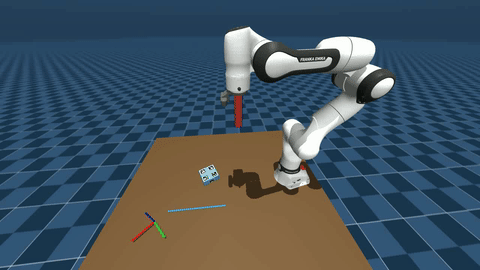
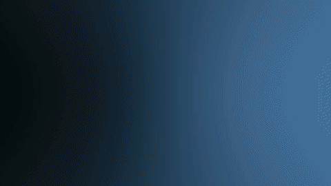

# Vision-Based NMPC for Robotic Pushing Under Perception Uncertainty

Closed-loop planar pusher–slider manipulation using Nonlinear Model Predictive Control (NMPC) driven by visual pose estimation. Three controller variants — a ground-truth baseline, certainty-equivalent MPC (CE-MPC), and chance-constrained MPC (CC-MPC) — are compared under synthetic perception disturbances in MuJoCo simulation.

> **ME/SE 740 Final Project — Boston University, Spring 2026**
> Full report available in [`docs/report.pdf`](docs/report.pdf)

---

## What this does

A Franka Panda arm pushes a rectangular slider to a goal pose on a flat table. Slider pose is estimated from ArUco/AprilTag markers using an eye-in-hand camera, fused through an Extended Kalman Filter. The NMPC solves a receding-horizon optimal control problem over quasi-static contact dynamics at every control step.

The key question studied: **does propagating EKF uncertainty into the MPC constraint set reduce constraint violations — and at what cost to task performance?**

---

## Demo

**Baseline (ground truth) · CE-MPC · CC-MPC (β = 1.645)**

| GT Baseline | CE-MPC | CC-MPC β = 1.645 |
|:-----------:|:------:|:----------------:|
|  |  |  |

*All clips: keepout wall constraint active, noise_high disturbance (σ_xy = 10 mm, σ_θ = 50 mrad). Dashed blue line = keep-out wall.*

**Effect of tightening factor β on CC-MPC**

| β = 0.5 (aggressive) | β = 1.645 (nominal) | β = 2.5 (conservative) |
|:--------------------:|:-------------------:|:----------------------:|
|  |  |  |

*Higher β → more wall clearance, lower task success rate. See Fig. 7 in the report for the quantitative trade-off.*

---

## Key results

360-run sweep (3 controllers × 3 disturbance types × 4 magnitudes × 2 workspace configs × 20 episodes):

| Condition | Baseline | CE-MPC | CC-MPC |
|-----------|:--------:|:------:|:------:|
| Success rate — clean, free | 0.95 | 0.93 | 0.85 |
| Success rate — noise_high, free | 0.89 | 0.39 | 0.55 |
| Violations/ep — noise_high, wall | 0.15 | 5.90 | 1.00 |
| Violations/ep — drop_high, wall | 0.15 | 2.66 | 0.37 |

**CC-MPC reduces constraint violations by 5.9–7.2× relative to CE-MPC when a keep-out wall is active.** In unconstrained workspace the benefit is modest; CC-MPC incurs an 8 percentage point success-rate overhead in clean conditions due to always-on constraint tightening.

---

## System architecture

```
Vision thread (60 Hz)          Propagation thread (100 Hz)
─────────────────────          ───────────────────────────
Camera frame                   EKF predict
  → ArUco detection              ← pending measurement
  → PnP pose estimate          EKF update
  → Disturbance model     →→→  EKF mean + covariance
                                 → NMPC solve (acados SQP-RTI)
                                   → Arm Cartesian controller
                                     → MuJoCo plant
```

**State machine:** Acquire → Approach → Pushing → Success / Lost / Failed

---

## Repository structure

```
vision_mpc/
├── src/
│   ├── mpc.py                  # NMPC formulation + CC tightening (acados)
│   ├── ekf.py                  # Extended Kalman Filter
│   ├── slider_observer.py      # Vision + EKF threading architecture
│   ├── pose_estimation.py      # ArUco/AprilTag detection, PnP, world transform
│   ├── path_planner.py         # Straight-line, circular, Dubins planners
│   ├── disturbance.py          # Noise / drop / latency injection
│   └── pusher_slider_controller.py  # State machine + closed-loop controller
├── configs/
│   ├── task_config.yaml        # MPC, EKF, vision, slider parameters
│   ├── study_config.yaml       # Scenario start/goal/keepout definitions
│   └── disturbance_config.yaml # Active disturbance level
├── experiments/
│   ├── run_sweep_sequential.sh # Full 360-run sweep
│   └── run_beta_sweep.sh       # β sensitivity study
├── docs/
│   ├── report.pdf              # Submitted final report
│   └── gifs/                   # Demo clips
├── main.py
└── requirements.txt
```

---

## Installation

### 1. Clone

```bash
git clone https://github.com/AlexanderWegenerRobotics/vision_mpc.git
cd vision_mpc
```

### 2. SimCore (simulation backend)

This project uses [SimCore](https://github.com/AlexanderWegenerRobotics/SimCore) as the MuJoCo simulation layer — robot kinematics, camera rendering, and object state access live there.

```bash
git clone https://github.com/AlexanderWegenerRobotics/SimCore.git
cd SimCore
pip install -e .
cd ..
```

### 3. Python dependencies

Python 3.10 recommended.

```bash
pip install -r requirements.txt
```

### 4. acados

acados is not pip-installable and must be built from source. Follow the [official installation guide](https://docs.acados.org/installation/index.html), then install the Python interface:

```bash
cd acados
pip install -e interfaces/acados_template
```

Set the required environment variable:

```bash
export ACADOS_SOURCE_DIR=/path/to/acados
```

Add this to your `.bashrc` / `.zshrc` to make it permanent.

---

## Running

### Single episode

```bash
python main.py --variant CERTAINTY_EQUIV
# variants: BASELINE | CERTAINTY_EQUIV | UNCERTAINTY_AWARE
```

### Full disturbance sweep (360 runs)

```bash
chmod +x experiments/run_sweep_sequential.sh
./experiments/run_sweep_sequential.sh
```

### β sensitivity sweep

```bash
chmod +x experiments/run_beta_sweep.sh
./experiments/run_beta_sweep.sh
```

---

## Configuration

All parameters live in `configs/task_config.yaml`. Key entries:

```yaml
mpc:
  variant: "UNCERTAINTY_AWARE"   # controller variant
  horizon: 100                   # MPC horizon steps
  dt: 0.01                       # discretisation interval [s]
  cc_beta: 1.645                 # CC tightening factor (95th percentile)
  cc_Q: [1e-6, 1e-6, 1e-5]      # CC-only horizon propagation noise
  ekf_Q: [1e-3, 1e-3, 1e-3]     # EKF process noise (separate from cc_Q)

goal_pos_tol:   0.010            # position tolerance [m]
goal_theta_tol: 0.149            # heading tolerance [rad]
timeout: 25.0                    # episode timeout [s]
```

---

## Contact dynamics model

Quasi-static pusher–slider dynamics after Hogan & Rodriguez (2016). State vector **x** = [x_S, y_S, θ_S, p_y]ᵀ, control **u** = [v_n, v_t]ᵀ. Contact modes (stick/slide) are handled implicitly by the NLP solver via smooth tanh approximation of the motion cone boundaries — no mixed-integer programming required.

---

## Citation

If you use this code, please cite the accompanying report:

```bibtex
@techreport{wegener2026visionmpc,
  author      = {Wegener, Alexander},
  title       = {Vision-Based {NMPC} for Robotic Pushing Under Perception Uncertainty},
  institution = {Boston University},
  year        = {2026},
  note        = {ME/SE 740 Final Project Report}
}
```

---

## References

- Hogan & Rodriguez, *Feedback Control of the Pusher-Slider System*, 2016
- Federico et al., *Nonlinear MPC for Robotic Pushing of Planar Objects with Generic Shape*, IEEE RA-L 2025
- Mesbah, *Stochastic Model Predictive Control: An Overview*, IEEE CSM 2016
- Verschueren et al., *acados: A Modular Framework for Fast Embedded Optimal Control*, MPC 2022
